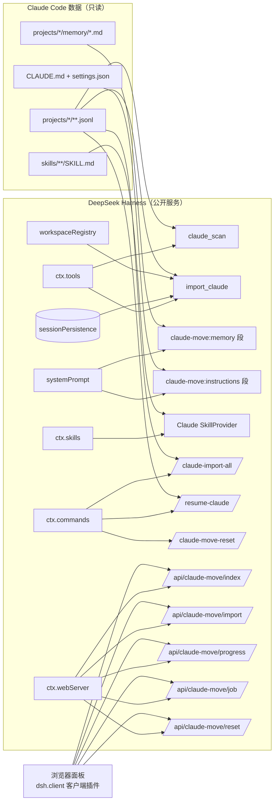

# ARCHITECTURE.md — dsh-claude-move 架构

## 总览

- **host 插件**（`index.mjs`）：注册两个工具、两组提示词段、一个技能 provider、三个命令、五个面板路由。只消费公开服务，不发布服务，不改引擎。
- **lib/**（零 DSH 依赖）：`convert`（JSONL→事件 + 流式转换器）、`discovery`（并行扫描+增量缓存+原子写）、`imports-store`（串行写+in-flight 锁）、`frontmatter`、`context`（同步注入 + memoryScope）、`skills-provider`（cwd/signal/项目技能）、`settings`（翻译建议）、`report`（S4/S5）、`handoff`（交接摘要）。
- **client/**（零构建 vanilla）：`__ModuleLoader__.load` 注册的面板，只依赖 DOM + 自注册 JSON 路由。
- **缓存**（`$DSH_HOME/claude-move/`）：`index.json`（扫描书签 mtime+ctime+size）、`imports.json`（**源文件路径 → 导入记录** `{ dshId, turns, events, sizeBytes, mtimeMs, sourceCwd }`，幂等 + 增量续写 + 源 cwd 保真共用）。

## 数据映射表（Claude JSONL → DSH SessionEvent）

| Claude Code JSONL | DSH SessionEvent | 备注 |
| --- | --- | --- |
| `{type:'user', message.content: string}`（直连提问） | `turn/start` + `step/start` + `user/message` | 每个提问开新轮 |
| `{type:'assistant', content:[{type:'text'}]}` | `assistant/message`（text 块） | 一条 assistant = 一步 |
| `{type:'assistant', content:[{type:'thinking'}]}` | `assistant/message` 内 `reasoning` 块 | 只进日志，不进续聊摘要 |
| `{type:'assistant', content:[{type:'tool_use'}]}` | `assistant/message` 内 `tool-call` 块 + `tool/call` 事件 | 参数 JSON 化 |
| `{type:'user', content:[{type:'tool_result'}]}` | `tool/result`（`sourceEventSeqs` → `tool/call`，`is_error` 保留） | 挂最近一步；重复结果去重、孤儿结果丢弃 |
| 被中断的 `tool_use`（无对应 `tool_result`） | 合成一条 `tool/result`（`isError: true`，标记文案） | 保证每个 tool_call_id 恰好一条结果（issue#1） |
| `{type:'custom-title'/'ai-title'}` | `session/title`（钉住，不被自动标题覆盖） | custom-title 优先 |
| `sessionId` / `cwd` / `timestamp` / `message.model` | `SessionHeader`（`id: import-<src>`、cwd、createdAt）+ assistant `source.model` | 源 id 缺失时用文件名 slug |
| `{type:'summary'}` 等辅助记录 | 跳过（typeCounts 计数） | 未知类型宽容跳过 |
| `permission` / `permission-mode` / `queue-operation` | 不导入，S5 只统计 | 报告给权限迁移建议 |
| 畸形行 | 跳过，`skippedLines: [{line, error}]` 行号上报 | 上限 200 条明细 |

事件纪律：seq 从 0 连续；surface 事件 `surfaceOp:'append'`；`tool/result.sourceEventSeqs` 关联；只 `create`+`append`（append-only）。

## 关键设计决策

1. **幂等键 = 源文件路径**（imports.json）：多个源文件可能共享同一源 sessionId（真实数据实测），按 sessionId 去重会静默丢历史；路径键 + 目标 id 冲突后缀避让（`import-<src>-<n>`）。
2. **可选服务响应式注册**（`internal/service`）：systemPrompt/skills/commands/webServer 可能晚于本插件就绪；apply 缺失则等事件，headless 无该服务也不 PENDING。
3. **未声明服务一律 `ctx.get()`**：真实 Cordis 对未声明属性访问抛错（"cannot get property without inject"）。
4. **rc.6 systemPrompt 同步约束**：memory/CLAUDE.md 段用 `statSync/readFileSync` + mtime/ctime 缓存（组装不 await async 提供者，实测确认）。
5. **面板零构建**：不依赖 rc.6 未文档化的 UI slot 内部面；数据走插件自注册的 `ctx.webServer` 精确路由（默认 loopback 绑定，与 apiproxy 同信任模型）。
6. **强制重导入（复制式）**：persistence 无 delete，且归档会把会话从全部界面隐藏——与「复制式迁移」冲突。`force: true` 改为以新 id（`import-<src>-<n>`）另存一份完整副本，旧副本原样保留；绝不归档、绝不删除。
7. **增量续写**：imports.json 记录已导入轮次与事件数；源文件增长后重导，用 `tailSessionEvents` 按 turn/start 边界截取新增轮次、seq 续写，同一 DSH 会话只 append 新事件（与运行中的 Claude Code 保持同步）。
8. **复制式迁移边界**：源文件只读、DSH 会话只 create+append、绝不调用 archiveSession/任何删除面；测试用「源文件内容前后不变」断言钉住该边界。
9. **导入后无需重启**（已对当前 harness 实测）：导入经 `sessionPersistence` 即时落盘，服务端 `session.list`/`workspace.list` 立即可见；但 UI 的 `host/session-added` 帧只对 live 会话（`session/created`）发射，cold 导入不发 → 已打开的 Web 页面需刷新一次会话列表（面板「刷新会话列表」按钮 / F5）；工作区分组经 `domain/changed` → `host/workspace-changed` 实时更新。面板与 `/claude-import-all` 报告都明示这一点。
10. **工具契约（exec.signal + 两阶段批量）**：`claude_scan`/`import_claude` 的 execute 签名 `(args, exec)`，全程检查 `exec.signal`（流式扫描逐行、批量并发阶段与落盘阶段每文件），中止抛 `signal.reason`；批量导入分两阶段——并发「读取+转换」（`importConcurrency` 默认 4，IO/CPU 密集、幂等无关），按文件名序**串行落盘**（id 后缀避让与 imports.json 映射依赖顺序，保证确定性）。`gitTimeoutMs` 配置化，消除硬编码可调参数。
11. **claudecode 工作区（默认，E2）**：`workspaceRegistry.attachSession` 要求 `realpath(header.cwd)` 与工作区路径严格相等，因此默认 `workspaceMode: 'claudecode'` 把全部导入会话的 cwd 覆写为独立目录 `claudecodeDir`（默认 `$DSH_HOME/claudecode`，插件在该目录下 `mkdir`——迁移唯一的有意写入），全部会话挂到标题「claudecode」的单一工作区；`workspaceMode: 'per-project'` 恢复按源项目 cwd 各建工作区的旧行为。源项目 cwd 保真记录进 imports.json 的 `sourceCwd`，memory/CLAUDE.md 注入按 `imports.json → index.json` 同步找回（`sourceCwdSync`，mtime 缓存），续聊交接摘要显式标注源项目目录。
12. **工具调用平衡修复（issue#1）**：OpenAI 兼容协议要求助手消息里每个 tool_call_id 恰好跟一条 tool 消息。合成期保证：每个声明的 tool/call 恰好一条 tool/result（真实结果去重取首条、被中断的调用补合成错误结果、孤儿结果丢弃），`validateSessionEvents` 自校验 + 测试钉住该不变式；否则导入会话续聊会永久 400。
13. **技能候选硬性契约（issue#1）**：DSH 技能系统对空 description 直接抛错并使技能目录整体加载失败。技能发现排除 README.md/MEMORY.md，缺失或空白 name/description 的技能文件跳过（与官方 skill-filesystem 的 warn+ignore 一致），绝不产出非法候选。
14. **sessionPersistence 双基线运行时 shim（0.4.0）**：宿主 master（0.1.3-alpha.1，bec6805d6a refactor）把 sessionPersistence handle 化（create→SessionHandle、服务级 append/readFrom/locate/listSnapshots 移除、list()/stat() 返回快照），但该 seam 不在任何已发布版本；已发布线（≤0.1.2-rc.1）仍是旧 API。index.mjs 内按 API 形状探测（create 返回值是否含 read/append/flush/close、服务是否含 open、list 元素带 header 还是 id），绝不按版本号猜测：handle 路径 append 后必须 `flush()`（耐久屏障）并成对 `close()`（单写所有权，失败路径 finally 释放）；旧路径调用序列与 0.3.x 逐字节一致。lib/ 保持零 DSH 依赖、零改动。handle 路径只能对照本地 checkout 验证（dev/checkout-handle.mjs，不提交），compat workflow 只覆盖已发布旧 API 线。
15. **handle 基线 header/事件规范化（0.4.0 checkout 实测）**：checkout 后端给所有产物盖当前格式版本文件名并要求 header.version 等于后端当前 SESSION_FORMAT_VERSION（读回时文件名/头部版本不一致即响亮拒绝）、isSeeded 显式给出（序列化丢弃 undefined）；读取还按当前格式语义校验 assistant/message 的 model source 必须是非空字符串。shim 在 handle 路径 create 前盖版本（来源：后端实例自报的 generationFormat.currentVersion，回退宿主 `@deepseek-ai/dsh-session` 的 SESSION_FORMAT_VERSION 惰性导入——绝无硬编码）并补 isSeeded:false，缺 model 的 assistant source 回退 provider 字符串；旧路径 header/事件不做任何规范化。
16. **imports.json 误清空守卫（0.4.0）**：annotateImports 的 cleanStale 依赖「已持久化 id 集合」完整可解析——旧代码在 handle 基线上会把快照对象当 SessionHeader 读 id（undefined），令全部映射被误判为失效并清空。现在任何列表元素解析不出 header.id 即响亮抛出（StoredSessionIdResolutionError）并中止扫描，cleanStale 结构性跳过；id 集合只接受完整解析的结果。

## 兼容与验证

- 目标：`dsh 0.1.2-alpha.5`（web profile，= 已发布 rc.1 源码线）；peerDeps 范围 `>=0.1.0-rc.8 <0.2.0`；纯 ESM 无构建（git/npm/tarball 三种安装均免 `prepare`/`allowBuilds`）。
- 已验证（本机真实数据 + 隔离 DSH_HOME）：`--dump-config` 行生效、web 启动无 FAILED、`__DSH_BOOT__` 客户端条目、`client.js` 伺服、index 路由扫描 40 项目/2387 会话、批量导入 13/13（同源 id 冲突后缀避让）、重导入 13/13 幂等、`workspace.attached=true`、会话产物落盘、重扫标注 `imported`。
- 0.4.0 双基线：旧 API 线由 mock ctx 回归套件（legacy 形状 create/append/readFrom/list）与 compat workflow（已发布 0.1.2-rc.1 peers）覆盖；handle 线由 test/persistence-handle.test.mjs（handle 形状 mock：close 泄漏、单写冲突、flush 顺序、误清空守卫）+ dev/checkout-handle.mjs 覆盖——后者以隔离 DSH_HOME 直接驱动宿主 checkout（0.1.3-alpha.1）真实 session-persistence-jsonl 后端（只读导入，绝不写入 checkout），验证 create→append→flush→close、list() 快照标注、增量续写与回迁导出。
- 待有 API key 的机器验收：导入后「点开续聊」的模型回合（详见 RELEASE.md 验收清单）。
