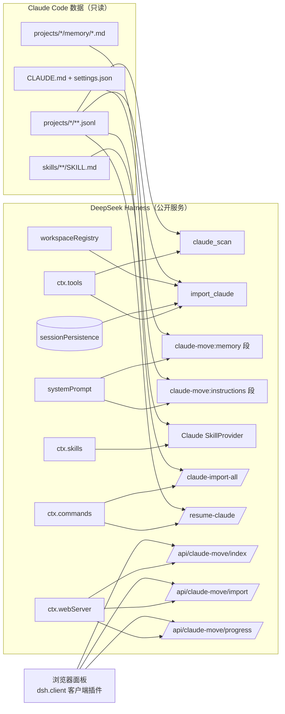

# ARCHITECTURE.md — dsh-claude-move 架构

## 总览

- **host 插件**（`index.mjs`）：注册两个工具、两组提示词段、一个技能 provider、两个命令、三个面板路由。只消费公开服务，不发布服务，不改引擎。
- **lib/**（零 DSH 依赖）：`convert`（JSONL→事件，vendored+扩展）、`discovery`（流式扫描+增量缓存）、`frontmatter`、`context`（同步注入）、`skills-provider`、`settings`（翻译建议）、`report`（S4/S5）、`handoff`（交接摘要）。
- **client/**（零构建 vanilla）：`__ModuleLoader__.load` 注册的面板，只依赖 DOM + 自注册 JSON 路由。
- **缓存**（`$DSH_HOME/claude-move/`）：`index.json`（扫描书签 mtime+ctime+size）、`imports.json`（**源文件路径 → DSH 会话 id** 幂等映射）。

## 数据映射表（Claude JSONL → DSH SessionEvent）

| Claude Code JSONL | DSH SessionEvent | 备注 |
| --- | --- | --- |
| `{type:'user', message.content: string}`（直连提问） | `turn/start` + `step/start` + `user/message` | 每个提问开新轮 |
| `{type:'assistant', content:[{type:'text'}]}` | `assistant/message`（text 块） | 一条 assistant = 一步 |
| `{type:'assistant', content:[{type:'thinking'}]}` | `assistant/message` 内 `reasoning` 块 | 只进日志，不进续聊摘要 |
| `{type:'assistant', content:[{type:'tool_use'}]}` | `assistant/message` 内 `tool-call` 块 + `tool/call` 事件 | 参数 JSON 化 |
| `{type:'user', content:[{type:'tool_result'}]}` | `tool/result`（`sourceEventSeqs` → `tool/call`，`is_error` 保留） | 挂最近一步 |
| `{type:'custom-title'/'ai-title'}` | `session/title`（钉住，不被自动标题覆盖） | custom-title 优先 |
| `sessionId` / `cwd` / `timestamp` / `message.model` | `SessionHeader`（`id: import-<src>`、cwd、createdAt）+ assistant `source.model` | 源 id 缺失时用文件名 slug |
| `{type:'summary'}` 等辅助记录 | 跳过（typeCounts 计数） | 未知类型宽容跳过 |
| `permission` / `permission-mode` / `queue-operation` | 不导入，S5 只统计 | 报告给权限迁移建议 |
| 畸形行 | 跳过，`skippedLines: [{line, error}]` 行号上报 | 上限 200 条明细 |

事件纪律：seq 从 0 连续；surface 事件 `surfaceOp:'append'`；`tool/result.sourceEventSeqs` 关联；只 `create`+`append`（append-only）。

## 关键设计决策

1. **幂等键 = 源文件路径**（imports.json）：多个源文件可能共享同一源 sessionId（真实数据实测），按 sessionId 去重会静默丢历史；路径键 + 目标 id 冲突后缀避让（`import-<src>-<n>`）。
2. **可选服务响应式注册**（`internal/service`）：systemPrompt/skills/commands/webServer 可能晚于本插件就绪；apply 缺失则等事件，headless 无该服务也不 PENDING。
3. **未声明服务一律 `ctx.get()`**：真实 Cordis 对未声明属性访问抛错（"cannot get property without inject"）。
4. **rc.6 systemPrompt 同步约束**：memory/CLAUDE.md 段用 `statSync/readFileSync` + mtime/ctime 缓存（组装不 await async 提供者，实测确认）。
5. **面板零构建**：不依赖 rc.6 未文档化的 UI slot 内部面；数据走插件自注册的 `ctx.webServer` 精确路由（默认 loopback 绑定，与 apiproxy 同信任模型）。
6. **强制重导入**：persistence 无 delete → `workspaceRegistry.archiveSession(旧)` + 新 id 重建，报告新旧映射。

## 兼容与验证

- 目标：`dsh 0.1.0-rc.6`（web profile）；peerDeps 显式锁 rc.6；纯 ESM 无构建（git/npm/tarball 三种安装均免 `prepare`/`allowBuilds`）。
- 已验证（本机真实数据 + 隔离 DSH_HOME）：`--dump-config` 行生效、web 启动无 FAILED、`__DSH_BOOT__` 客户端条目、`client.js` 伺服、index 路由扫描 40 项目/2387 会话、批量导入 13/13（同源 id 冲突后缀避让）、重导入 13/13 幂等、`workspace.attached=true`、会话产物落盘、重扫标注 `imported`。
- 待有 API key 的机器验收：导入后「点开续聊」的模型回合（详见 RELEASE.md 验收清单）。
