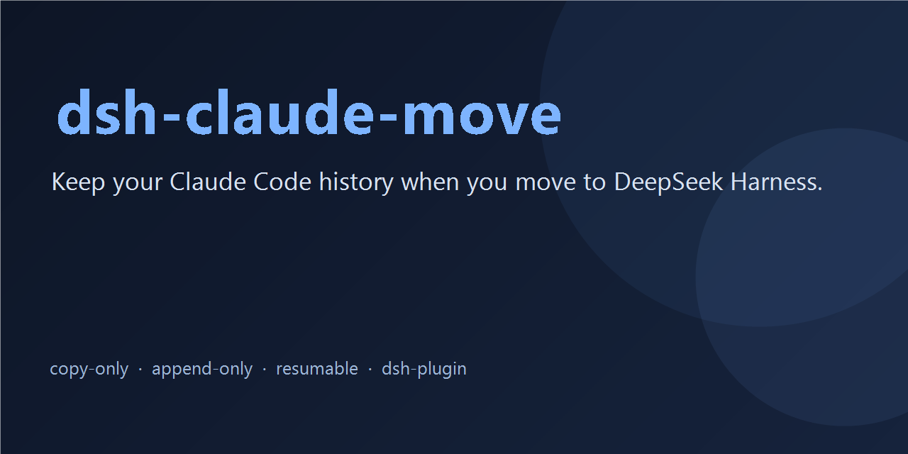

# dsh-claude-move

**DeepSeek Harness पर जाते समय अपना Claude Code इतिहास बनाए रखें।** एक ही इंस्टॉल में Claude का हर सत्र, याद, कौशल और `CLAUDE.md` DSH में फिर-से-शुरू होने योग्य सत्रों के रूप में **कॉपी** हो जाता है — हर Claude प्रोजेक्ट के लिए एक वर्कस्पेस में व्यवस्थित।

`केवल-कॉपी` · `बिना रुकावट जारी` · `प्रोजेक्ट-वार वर्कस्पेस` · `Claude Code के साथ लाइव तालमेल`

[](https://github.com/PerryLink/dsh-claude-move/actions/workflows/test.yml)
[](https://nodejs.org)
[](LICENSE)
[](https://github.com/topics/dsh)
[](https://github.com/topics/dsh-plugin)
[](https://github.com/PerryLink/dsh-claude-move/issues)



[English](README.md) | [中文](README.zh.md) | [Español](README.es.md) | [Português](README.pt.md) | हिन्दी

> डेवलपर पूर्वावलोकन (0.1.0)। रोडमैप और डिज़ाइन: [PLAN.md](PLAN.md) · परिवर्तन इतिहास: [CHANGELOG.md](CHANGELOG.md)।

## ✨ विशेषताएँ

- 🔍 **स्वतः खोज** — Claude का डेटा रूट (`$CLAUDE_CONFIG_DIR`, डिफ़ॉल्ट `~/.claude`) ढूँढता है और हर प्रोजेक्ट/सत्र (शीर्षक, समय, गिनतियाँ), डायरेक्टरी व git स्थिति, यादें, कौशल, वैश्विक `CLAUDE.md` और `settings.json` को अनुक्रमित करता है — वृद्धिशील कैश से सिर्फ़ बदली फ़ाइलें दोबारा पढ़ी जाती हैं।
- 📥 **पूर्ण-विश्वसनीय इतिहास आयात** — संतुलित, फिर-से-शुरू होने योग्य DSH सत्र (`turn/start → step/start → user/message → assistant/message → tool/call → tool/result → step/end → turn/end`), हर Claude प्रोजेक्ट के लिए एक वर्कस्पेस, ख़राब पंक्तियाँ पंक्ति-संख्या सहित।
- 🔁 **केवल-कॉपी और वृद्धिशील** — किसी भी तरफ़ कुछ हटता/बदलता नहीं। दोबारा आयात करने पर सिर्फ़ नए टर्न उसी DSH सत्र में जुड़ते हैं; `force: true` नए id से एक अतिरिक्त पूरी कॉपी बचाता है।
- 🧠 **व्यक्तिगत संदर्भ हमेशा ताज़ा** — यादें लाइव प्रॉम्प्ट खंड के रूप में, Claude के कौशल असली DSH कौशल के रूप में, वैश्विक + प्रोजेक्ट `CLAUDE.md` शुरुआती खंड के रूप में।
- ⚡ **चल रहे Claude Code के साथ लाइव तालमेल** — दोनों टूल साथ-साथ चलाएँ; हर री-रन सिर्फ़ बदलाव लाता है।
- 🖥 **वेब पैनल और एक-चरण कमांड** — `/claude-import-all`, `/resume-claude` और प्रोग्रेस वाला तैरता माइग्रेशन पैनल।
- 🛡 **सुरक्षा सबसे पहले** — स्रोत फ़ाइलें सख़्ती से केवल-पठन, DSH लॉग append-only, सीक्रेट केवल स्थान से, अनुमति-रिकॉर्ड गिने जाते हैं पर आयात कभी नहीं होते।

## 🚀 त्वरित शुरुआत

```sh
# 1. इंस्टॉल
dsh plugin --profile web add -w github:PerryLink/dsh-claude-move
```

2. किसी भी DSH सत्र में एक कमांड चलाएँ:

```
/claude-import-all      # स्कैन → हर Claude सत्र कॉपी → रिपोर्ट
```

3. पहले से खुले वेब पृष्ठ को एक बार ताज़ा करें (पैनल में «सत्र सूची ताज़ा करें» बटन है) और किसी भी आयातित सत्र पर क्लिक करके जारी रखें। **DSH रीस्टार्ट की ज़रूरत नहीं** — देखें [आयात के बाद](#-आयात-के-बाद)।

बारीक़ नियंत्रण चाहिए?

```
claude_scan                                     # सभी प्रोजेक्ट/सत्रों की संरचित अनुक्रमणिका
import_claude { path: "~/.claude/projects" }    # एक प्रोजेक्ट डायरेक्टरी (पुनरावर्ती)
import_claude { path: "all" }                   # सब कुछ
```

## 🗂 क्या माइग्रेट होता है

```
~/.claude (केवल-पठन)
 ├─ projects/*/*.jsonl  ──→  फिर-से-शुरू होने योग्य DSH सत्र, हर प्रोजेक्ट (cwd) का एक वर्कस्पेस
 ├─ projects/*/memory/  ──→  सिस्टम-प्रॉम्प्ट का लाइव याद-खंड (हर अनुरोध पर दोबारा पढ़ा जाता है)
 ├─ skills/**           ──→  असली DSH कौशल
 └─ CLAUDE.md + settings ──→  शुरुआती प्रॉम्प्ट खंड + कॉन्फ़िगरेशन सुझाव (कभी अपने-आप लागू नहीं)
```

| Claude Code में | DSH में बनकर उतरता है |
| --- | --- |
| सत्र ट्रांसक्रिप्ट (`projects/*/*.jsonl`) | संतुलित, फिर-से-शुरू होने योग्य DSH सत्र — `user`/`assistant`/`tool`/`thinking` की पूर्ण-विश्वसनीय मैपिंग — हर प्रोजेक्ट (`cwd`) के लिए एक वर्कस्पेस में समूहित |
| यादें (`projects/*/memory/*.md`) | सिस्टम-प्रॉम्प्ट का लाइव संदर्भ खंड, हर अनुरोध पर दोबारा पढ़ा जाता है (`feedback > project > reference > user`) |
| कौशल (`~/.claude/skills/**`) | असली DSH कौशल (kebab-case नाम, टकराव पर प्रत्यय, डिफ़ॉल्ट अधिकतम 30) |
| `CLAUDE.md` (वैश्विक + प्रोजेक्ट-स्तरीय) | शुरुआती प्रॉम्प्ट खंड; प्रोजेक्ट फ़ाइल को प्राथमिकता |
| `settings.json` | DSH कॉन्फ़िगरेशन सुझाव + अनमैप-योग्य कुंजियों की स्पष्ट सूची |
| प्रोजेक्ट स्थिति (डायरेक्टरी, git ब्रांच व बदली फ़ाइलें) | स्कैन अनुक्रमणिका और वेब पैनल बैज में दिखती है |

## 📦 इंस्टॉलेशन

```sh
# GitHub से
dsh plugin --profile web add -w github:PerryLink/dsh-claude-move

# स्थानीय चेकआउट (विकास हेतु)
dsh plugin --profile web add -w link:/path/to/dsh-claude-move

# पैक किए गए tarball से
dsh plugin --profile web add -w ./dsh-claude-move-0.1.0.tgz
```

पैकेज शुद्ध ESM है और इसमें कोई बिल्ड चरण नहीं है, इसलिए Git से इंस्टॉल में `prepare` स्क्रिप्ट या `allowBuilds` प्रविष्टि की ज़रूरत नहीं। आधिकारिक [पैकेजिंग व इंस्टॉल गाइड](https://deepseek-harness.github.io/deepseek-harness/develop/basic/publish) देखें।

## 🛠 उपयोग

प्लगइन माउंट होने पर किसी भी सत्र में टूल बुलाएँ:

```
claude_scan                          # पूर्ण स्कैन (वृद्धिशील कैश)
claude_scan { path: "~/.claude/projects/<slug>" }   # आंशिक स्कैन
claude_scan { refresh: true }        # कैश छोड़कर पूरा दोबारा स्कैन

import_claude { path: "~/.claude/projects/<slug>/<sessionId>.jsonl" }  # एक सत्र
import_claude { path: "~/.claude/projects" }        # डायरेक्टरी (पुनरावर्ती)
import_claude { path: "all" }                       # सब कुछ
# कभी भी दोबारा चला सकते हैं: बिना बदलाव वाली फ़ाइलें छूट जाती हैं, बढ़ी हुई ट्रांसक्रिप्ट में सिर्फ़ नए टर्न जुड़ते हैं।
import_claude { path: "...", force: true }          # import-<src>-<n> के रूप में नई पूरी कॉपी (पुरानी कॉपी सुरक्षित)
```

कमांड (उपयोगकर्ता-ट्रिगर, कोई मॉडल टर्न नहीं):

```
/claude-import-all                # एक चरण: स्कैन → सब आयात → रिपोर्ट → वर्तमान सत्र में इंजेक्ट
/resume-claude latest             # सबसे हालिया Claude सत्र जारी करें
/resume-claude <sessionId>        # स्रोत सत्र id या import-<src> id से
/resume-claude <कीवर्ड>          # शीर्षकों से मिलान; कई मिलान सूचीबद्ध होते हैं, अंदाज़ा कभी नहीं
/claude-move-reset                # प्लगइन कैश रीसेट करें (बुकमार्क + आयात मैप); आयातित सत्र सुरक्षित रहते हैं
```

वेब पैनल: नीचे-दाएँ तैरता **🐳 Claude 迁移** बटन पैनल खोलता है — प्रोजेक्ट/सत्र ट्री (स्थिति बैज: आयात नहीं / आयातित / आयातित-नए-टर्न / स्रोत अनुपलब्ध / डायरेक्टरी मौजूद नहीं / git गंदा), कीवर्ड फ़िल्टर, पृष्ठांकन, प्रति-सत्र «आयात करें और जारी रखें» + «सत्र खोलें» + «सत्र सूची ताज़ा करें», रद्द करने की सुविधा के साथ बैच आयात प्रोग्रेस बार, और कैश-रीसेट बटन। पाठ ब्राउज़र भाषा के अनुसार zh/en होते हैं। डेटा प्लगइन की अपनी `/api/claude-move/*` JSON रूट्स से आता है (सार्वजनिक `ctx.webServer` seam)।

- **स्कैन** एक संरचित JSON अनुक्रमणिका लौटाता है: प्रोजेक्ट (slug/cwd/डायरेक्टरी की मौजूदगी/git ब्रांच व बदली फ़ाइलें), सत्र (शीर्षक/समय/गिनतियाँ/ख़राब पंक्तियाँ), यादें, कौशल, वैश्विक CLAUDE.md व settings.json; हर सत्र में `import.status` (`none`/`imported`/`source-missing`) और नए अनसिंक टर्न होने पर `import.updatesPending` होता है। `settingsSuggestions` में settings.json का DSH अनुवाद और अनमैप-योग्य कुंजियाँ होती हैं (देखें [COMPLIANCE.md](COMPLIANCE.md))।
- **आयात** user/assistant/tool/thinking संदेशों को पूरी विश्वसनीयता से मैप करता है; परिणाम एक संतुलित, फिर-से-शुरू होने योग्य सत्र होता है जो `cwd` द्वारा अपने वर्कस्पेस से जुड़ा होता है। बैच फ़ाइल-दर-फ़ाइल सारांश देता है (`imported`/`appended`/`already-imported`/`skipped`/`failed`), ख़राब पंक्तियाँ पंक्ति-संख्या के साथ आती हैं, संदिग्ध सीक्रेट केवल स्थान से बताए जाते हैं (फ़ाइल:पंक्ति:प्रकार) और अनुमति-श्रेणी रिकॉर्ड गिने जाते हैं, आयात कभी नहीं होते। आयात कभी कुछ हटाता या दोबारा लिखता नहीं: DSH के मौजूदा सत्र अछूते रहते हैं, पहले से आयातित कॉपियाँ सुरक्षित रहती हैं, और Claude की स्रोत फ़ाइलें कभी लिखी नहीं जातीं।
- **व्यक्तिगत संदर्भ अपने आप लागू होता है** (कोई आयात क्रिया ज़रूरी नहीं):
  - यादें: `projects/*/memory/*.md` गतिशील खंड के रूप में इंजेक्ट होते हैं, हर अनुरोध पर दोबारा पढ़े जाते हैं (नई यादें तुरंत लागू), क्रम `feedback > project > reference > user`, डिफ़ॉल्ट सीमा 8 KiB। `memoryScope: current-project` (डिफ़ॉल्ट) पर केवल वर्तमान सत्र के प्रोजेक्ट की यादें इंजेक्ट होती हैं (cwd का कोई मेल न होने पर सभी प्रोजेक्ट पर वापसी); `all` सब कुछ इंजेक्ट करता है, वर्तमान प्रोजेक्ट पहले।
  - कौशल: `~/.claude/skills/**/SKILL.md` (साथ में सपाट `*.md`) और वर्तमान प्रोजेक्ट का `.claude/skills/**` DSH कौशल बन जाते हैं (नाम kebab-case में, टकराव पर प्रत्यय, अधिकतम 30); कैटलॉग और `skill` टूल DSH का काम है।
  - निर्देश: वैश्विक `~/.claude/CLAUDE.md` और वर्तमान सत्र का `.claude/CLAUDE.md` शुरुआती खंड के रूप में इंजेक्ट होते हैं (प्रोजेक्ट को प्राथमिकता)।

## ✅ आयात के बाद

**DSH को दोबारा शुरू (restart) करने की ज़रूरत नहीं है।** आयात पूरा होते ही सार्वजनिक `sessionPersistence` सेवा के ज़रिए स्थायी रूप से लिख दिया जाता है:

- सर्वर-साइड सूचियाँ (`session.list` / `workspace.list` RPC, CLI, कोई भी नया खुला पृष्ठ) आयातित सत्र और उनके प्रोजेक्ट-वार वर्कस्पेस तुरंत दिखाती हैं।
- पैनल पहले से खुले पृष्ठ की सत्र सूची स्वयं ताज़ा करता है (shell के `sessions`/`workspaces` क्लाइंट सेवाएँ, क्षमता-जाँच से) और हर आयातित सत्र के लिए «सत्र खोलें» बटन देता है; इन सेवाओं के बिना पुराने shells में «सत्र सूची ताज़ा करें» बटन / पृष्ठ रीलोड पर वापसी होती है — आयात सीधे पर्सिस्टेंस सेवा में cold सत्र लिखता है, इसलिए लाइव `host/session-added` फ़्रेम नहीं जाता; वर्कस्पेस समूह लाइव अपडेट होते हैं (`host/workspace-changed`)।
- आयातित सत्र तुरंत खोले, पढ़े और जारी किए जा सकते हैं — `/resume-claude`, या सूची में सत्र पर क्लिक करें। कभी भी दोबारा आयात चलाने पर केवल नए टर्न उन्हीं सत्रों में जुड़ते हैं।

## ⚙️ कॉन्फ़िगरेशन

सब वैकल्पिक, `cordis.yml` में बदले जा सकते हैं:

```yaml
- id: claude-move
  name: dsh-claude-move
  config:
    claudeHome: null            # डिफ़ॉल्ट: $CLAUDE_CONFIG_DIR या ~/.claude
    scanGit: true               # git जाँच स्तर: true पूर्ण | 'branch' शून्य सबप्रोसेस | false
    gitTimeoutMs: 5000          # git सबप्रोसेस समय-सीमा
    scanConcurrency: 8          # प्रोजेक्ट स्कैन समानांतर सीमा
    maxTranscriptBytes: 67108864
    excludeProjects: []         # छोड़ने के लिए slug सबस्ट्रिंग, जैसे ['demo-']
    enableMemory: true
    memoryMaxBytes: 8192
    memoryScope: current-project  # 'current-project' केवल वर्तमान प्रोजेक्ट | 'all' सब, वर्तमान पहले
    enableSkills: true
    maxSkills: 30
    extraSkillDirs: []
    enableInstructions: true
    resumeMaxChars: 2048      # हैंडऑफ़ सारांश की अक्षर-सीमा
    resumeMode: inject        # 'inject' हैंडऑफ़ सारांश | 'agents' ctx.agents.resume
    enableWebPanel: true      # /api/claude-move/* पैनल रूट्स पंजीकृत करें
    importConcurrency: 4      # प्रति बैच पढ़ना+रूपांतरण समानांतर सीमा (सहेजना क्रमिक रहता है)
```

## 🗑 अनइंस्टॉल

प्रोफ़ाइल के bundles से `claude-move` पंक्ति हटाएँ और `dsh` रीस्टार्ट करें। आयातित सत्र DSH के डेटा डायरेक्टरी में बने रहते हैं; प्लगइन केवल अपना कैश (`$DSH_HOME/claude-move/`) लिखता है और Claude के स्रोत डेटा को कभी नहीं छूता।

## 🧭 संगतता

- लक्ष्य `dsh 0.1.0-rc.6` (वेब प्रोफ़ाइल); peer निर्भरताएँ `0.1.0-rc.6` पर पिन। Node `^22.19 || >=24`।
- अंतिम सत्यापन **2026-08-13** विंडोज़ (Node 22) पर `@deepseek-ai/dsh@0.1.0-rc.6` के विरुद्ध: tarball से शून्य-से इंस्टॉल, वास्तविक स्कैन (40 प्रोजेक्ट / 2387 सत्र), वास्तविक बैच आयात 13/13 + आइडेम्पोटेंट पुनः-आयात 13/13, वर्कस्पेस जुड़ाव व पर्सिस्टेंस आर्टिफ़ैक्ट पुष्ट। macOS/Linux अब CI मैट्रिक्स (linux/macos/windows × Node 22) से आच्छादित।
- **2026-08-14** को वर्तमान `deepseek-harness` चेकआउट (वेब प्रोफ़ाइल, JSONL+zstd सत्र बैकएंड, वास्तविक वर्कस्पेस रजिस्ट्री) के विरुद्ध पृथक home में सत्यापित: प्लगइन माउंट कर पूरा वेब बूट, पैनल रूट्स से स्कैन + पूर्ण आयात, `cwd`-वार वर्कस्पेस निर्माण व सत्र जुड़ाव, मौजूदा आयातित सत्र में वृद्धिशील जुड़ाव (seq निरंतर, साफ़ लोड), रीस्टार्ट-सुरक्षित पुनः-आयात, और पूरी प्रक्रिया में पहले से मौजूद DSH सत्र अछूते। कोई सत्र कभी आर्काइव, हटाया या दोबारा लिखा नहीं जाता।

### संगतता मैट्रिक्स (केवल सार्वजनिक seams)

| सतह | उपयोग | अनुपस्थिति पर वापसी |
| --- | --- | --- |
| host सेवाएँ (`tools` / `sessionPersistence` / `workspaceRegistry` / `commands` / `systemPrompt` / `skills` / `webServer`) | सूचीबद्ध जगह उपयोग | वैकल्पिक सेवाएँ `internal/service` से प्रतिक्रियाशील रूप से पंजीकृत होती हैं; `fs` अनुपस्थिति ज़ोर से विफल |
| `sessionPersistence.listSnapshots` / `readFrom`, `fs.streamText`, `ctx.jobs`, `ctx.agents.resume` | क्षमता-जाँच | `list()` / पूर्ण पठन + ज़ोर से अस्वीकार / अपनी job तालिका / सारांश इंजेक्शन |
| shell क्लाइंट सेवाएँ (`sessions.refresh/open`, `workspaces.refresh`) | पैनल apply पर क्षमता-जाँच | पूर्ण पृष्ठ रीलोड |
| नई प्लेटफ़ॉर्म क्षमताएँ कभी कठोर आवश्यकता नहीं — प्लगइन rc.6 पर हमेशा बूट होता है। | | |

## 🔐 अनुमतियाँ और डेटा

- **पढ़ता है** `~/.claude` (ट्रांसक्रिप्ट, यादें, कौशल, CLAUDE.md, settings.json) — सख़्ती से केवल-पठन — और वे प्रोजेक्ट डायरेक्टरी जिनमें आयात करता है (वर्कस्पेस जुड़ाव)।
- **लिखता है** DSH सत्र लॉग सार्वजनिक `sessionPersistence` सेवा के ज़रिए — केवल create + append, मौजूदा सत्र कभी हटाता/दोबारा लिखता/आर्काइव नहीं करता — वर्कस्पेस रजिस्ट्री रिकॉर्ड, और अपना कैश `$DSH_HOME/claude-move/` (स्कैन बुकमार्क + आयात मैप)।
- **कभी नहीं** Claude की स्रोत फ़ाइलें बदलता, अन्य एप्लिकेशन का डेटा छूता, या नेटवर्क एक्सेस करता।
- **कोई क्रेडेंशियल** पढ़ा या भेजा नहीं जाता; ट्रांसक्रिप्ट में संदिग्ध सीक्रेट केवल स्थान से बताए जाते हैं।

## 🛡 सुरक्षा सीमाएँ

- स्रोत फ़ाइलें सख़्ती से केवल-पठन; DSH सत्र लॉग append-only (केवल `create` + `append`)।
- बाहरी ट्रांसक्रिप्ट अविश्वसनीय इनपुट हैं: उनमें कुछ भी निष्पादित नहीं होता; system/developer/thinking सामग्री हैंडऑफ़ सारांश में कभी नहीं जाती।
- DSH इंजन, आधिकारिक UI पैकेज या apiproxy में कोई बदलाव नहीं — केवल सार्वजनिक सेवाएँ (`sessionPersistence` / `workspaceRegistry` / `tools` / `commands` / `systemPrompt` / `skills` / `webServer`)।
- संदिग्ध सीक्रेट केवल स्थान से बताए जाते हैं (सामग्री कभी नहीं); `permission`/`permission-mode`/`queue-operation` रिकॉर्ड गिने जाते हैं, आयात नहीं होते।

## 🩺 समस्या-निवारण

- पंक्ति असर नहीं दिखा रही: `dsh --profile <p> --dump-config` में `# == dsh-claude-move` छपना चाहिए; `dsh plugin --profile <p> add -w ...` दोबारा चलाएँ।
- वेब बूट होकर चुपचाप लटक जाए: `dsh plugin add` से बने नए प्रोफ़ाइल में सिर्फ़ `dsh-base` होता है — `dsh.profile.bundles` में `@deepseek-ai/dsh-web-app` जोड़ें (मौजूदा `web` प्रोफ़ाइल में इंस्टॉल करने पर कुछ नहीं चाहिए)।
- पैनल रूट्स 404: वे केवल तब चलती हैं जब `enableWebPanel: true` और कोई वेब सर्वर कम्पोज़ हो; बूट लॉग में FAILED फ़ाइबर देखें।
- आयात में "transcript 过大" विफलता: `maxTranscriptBytes` बढ़ाएँ या वह फ़ाइल अलग से आयात करें।
- आयात सफल पर साइडबार में नया सत्र नहीं दिखा: पृष्ठ पहले से खुला था — पैनल का «सत्र सूची ताज़ा करें» एक बार दबाएँ (या पृष्ठ रीलोड करें)। DSH रीस्टार्ट कभी ज़रूरी नहीं।
- लॉग: बूट विफलताएँ `dsh` कंसोल पर छपती हैं; प्लगइन वर्कस्पेस/आयात-मैप समस्याओं के लिए `[claude-move]` उपसर्ग से त्रुटियाँ लॉग करता है।

## 📚 दस्तावेज़

- [PLAN.md](PLAN.md) — शोध निष्कर्ष और कार्यान्वयन योजना।
- [ARCHITECTURE.md](ARCHITECTURE.md) — आर्किटेक्चर आरेख और पूर्ण डेटा-मैपिंग तालिका।
- [COMPLIANCE.md](COMPLIANCE.md) — आधिकारिक प्लगइन प्रतिबंधों के विरुद्ध खंड-दर-खंड ऑडिट (deepseek-harness repo व docs, [deepseek.com/harness](https://www.deepseek.com/harness/), [डेवलपर दस्तावेज़](https://deepseek-harness.github.io/deepseek-harness/develop/basic/), [Cordis](https://github.com/cordiverse/cordis) व [Cordis पेपर](https://github.com/cordiverse/paper))।
- [OPTIMIZATION.md](OPTIMIZATION.md) — मापी गई आधार-रेखाएँ और क्रमबद्ध अनुकूलन उम्मीदवार।
- [RELEASE.md](RELEASE.md) — स्वीकृति प्रमाण के साथ रिलीज़ चेकलिस्ट।
- [CHANGELOG.md](CHANGELOG.md) — हर संस्करण में क्या बदला।

## 🙏 एट्रिब्यूशन (ओपन-सोर्स घटक)

यह प्रोजेक्ट Apache License 2.0 के अंतर्गत है; निम्न MIT-लाइसेंस प्राप्त घटक अपने लाइसेंस बनाए रखते हैं (पूरा पाठ [THIRD_PARTY_NOTICES.md](THIRD_PARTY_NOTICES.md) में):

- रूपांतरण कोर [Nwflower/dsh-chat-import](https://github.com/Nwflower/dsh-chat-import) (MIT) से vendored।
- खोज परिपाटियाँ व सुरक्षा मॉडल [Demogorgon314/dsh-resume-plugin](https://github.com/Demogorgon314/dsh-resume-plugin) (MIT; इसका `session_reader.py` Apache-2.0 मूल का है — देखें [THIRD_PARTY_NOTICES.md](THIRD_PARTY_NOTICES.md)) से।
- memory/skills इंजेक्शन व frontmatter पार्सिंग पैटर्न [YYTbit/dsh-plugin-claude-bridge](https://github.com/YYTbit/dsh-plugin-claude-bridge) (MIT) से।

## 🧑‍💻 विकास

```sh
npm install   # peer deps: @deepseek-ai/cordis, @deepseek-ai/dsh-tools@0.1.0-rc.6, @deepseek-ai/schemastery
npm test      # node --test: convert (vendored + विस्तारित), discovery, import/report, context, settings
```

CI GitHub Actions ([test.yml](.github/workflows/test.yml)) के ज़रिए Node 22 पर पूरी सुइट चलाता है।

## 🧠 Model Experience

- मॉडल-दृश्य सतह दो टूल्स की description/schema और उनके आउटपुट हैं: `claude_scan` संरचित अनुक्रमणिका लौटाता है, `import_claude` चेतावनी-स्थानों सहित फ़ाइल-दर-फ़ाइल सारांश लौटाता है। टूल परिणाम स्वयं लॉग किए गए `tool/result` इवेंट होते हैं, इसलिए सब कुछ पुनर्निर्माण-योग्य है।
- कोई छिपा मॉडल-दृश्य पाठ नहीं; memory/CLAUDE.md खंड `ctx.systemPrompt` पर पंजीकृत हैं (प्रॉम्प्ट असेंबली, सत्र लॉग से पुनर्निर्माण-योग्य)।

## ⚠️ ज्ञात सीमाएँ

- शीर्षक `custom-title`/`ai-title`/पहले प्रश्न से आते हैं; Claude के `summary` रिकॉर्ड शीर्षक नहीं बनते।
- `thinking` ब्लॉक आयातित लॉग में `reasoning` सामग्री के रूप में रहते हैं, पर हैंडऑफ़ सारांश में कभी नहीं जाते।
- अनुमति-श्रेणी रिकॉर्ड गिने जाते हैं, आयात नहीं होते; DSH अनुमति-प्रीसेट सुझाव रिपोर्ट में बनते हैं।
- Claude के `summary` रिकॉर्ड (संदर्भ संपीड़न) केवल रिपोर्ट होते हैं, DSH compaction नोड्स में मैप नहीं होते (कारण OPTIMIZATION.md में); पूरा इतिहास मूल टर्न के रूप में आयात होता है।
- `fs.streamText` सतह वाले host पर `maxTranscriptBytes` से बड़ी ट्रांसक्रिप्ट स्वतः स्ट्रीमिंग खंडों में आयात होती हैं (मेमोरी O(खंड)); बिना उस सतह के वे आंशिक आयात की बजाय ज़ोर से विफल होती हैं।
- जिन सत्रों की स्रोत डायरेक्टरी हट चुकी है वे फिर भी आयात होते हैं, पर वर्कस्पेस जुड़ाव विफल रहता है (बिना समूह; रिपोर्ट में `workspace.attached: false` + `reason`)।
- बाधित बैच आयात सुरक्षित रूप से दोबारा चलाए जा सकते हैं (आइडेम्पोटेंट, append-only): पूरी फ़ाइलें छूट जाती हैं, बढ़ी हुई फ़ाइलें सिर्फ़ नए टर्न जोड़ती हैं।
- यदि कोई ट्रांसक्रिप्ट अपनी जगह कटी/रीसेट हुई (दर्ज आयात से कम टर्न), पुनः-आयात उसे छोड़कर `sourceShrunk` बताता है; नई पूरी कॉपी के लिए `force: true`।
- वेब पैनल शून्य-बिल्ड तैरता पैनल है, प्लगइन की अपनी JSON रूट्स से चलता है; shell के आंतरिक UI स्लॉट सिस्टम का उपयोग नहीं करता (rc.6 के अनडॉक्यूमेंटेड internals से स्वतंत्र)।
- स्ट्रीमिंग वृद्धिशील जुड़ाव में एक बार के `messages`/`toolCalls` केवल नए जुड़े ईवेंट गिनते हैं (संग्रहीत उपसर्ग दोबारा नहीं पढ़ा जाता); `turns` पूर्ण गिनती रहती है।

## 🤝 योगदान और प्रतिक्रिया

Issue और pull request स्वागत योग्य हैं — दिए गए टेम्पलेट उपयोग करें ([बग रिपोर्ट](.github/ISSUE_TEMPLATE/bug-report.yml), [फ़ीचर अनुरोध](.github/ISSUE_TEMPLATE/feature-request.yml))। प्रश्न और चर्चा रेपो की GitHub Discussions में होती हैं। सुरक्षा समस्याएँ निजी तौर पर GitHub Security Advisories (रेपो Settings → Security) से रिपोर्ट करें।

## 🔗 संबंधित लिंक

- DeepSeek Harness: [रेपो](https://github.com/deepseek-ai/deepseek-harness) · [साइट](https://www.deepseek.com/harness/) · [डेवलपर दस्तावेज़](https://deepseek-harness.github.io/deepseek-harness/develop/basic/)
- प्लगइन पारिस्थितिकी: [`dsh` टॉपिक](https://github.com/topics/dsh) · [`dsh-plugin` टॉपिक](https://github.com/topics/dsh-plugin) · [Discord](https://discord.gg/Ycq5dCaS4)

## 📄 लाइसेंस

Apache License 2.0 — देखें [LICENSE](LICENSE) और [NOTICE](NOTICE)। तृतीय-पक्ष सूचनाएँ (MIT घटकों का MIT मूल पाठ सहित) [THIRD_PARTY_NOTICES.md](THIRD_PARTY_NOTICES.md) में।
